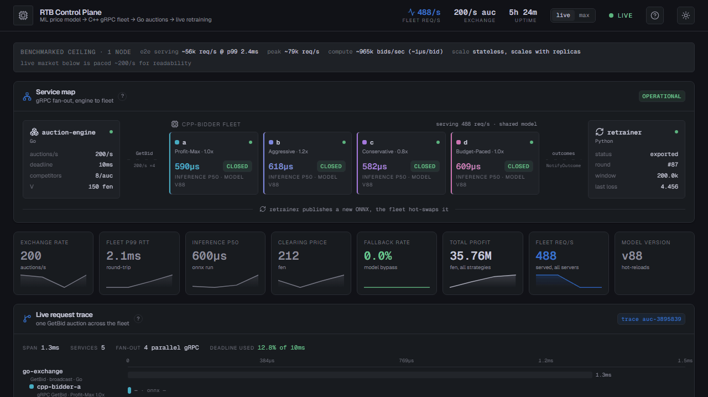
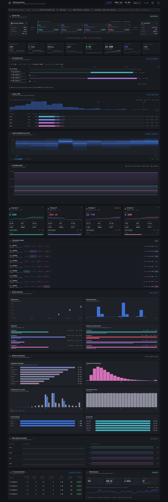

# RTB Bid Engine

Real-time bidding engine for first-price ad auctions. Predicts the full
distribution of competitor bids and picks the bid that maximizes expected
profit.

**Stack:** Python (PyTorch, ONNX Runtime) | C++17 (gRPC async server, ONNX
Runtime) | Go (auction engine) | Next.js / React (telemetry console) | Docker
Compose | Prometheus + Grafana. Trained on real iPinYou auction data, served by
a stateless C++ fleet, with a closed online retraining loop.

**▶ [Live console](https://rtb-control-plane.vercel.app)** is a real-time
telemetry dashboard for the whole system. It has three modes (Live, Recorded
demo, and Max). Always-on and free: when the cloud backend is off it never goes
dark, it falls back to a recorded run of real data.



## Highlights

- **~965,000 bids/sec** of raw inference throughput on one 16-vCPU node
  (~1.0us per bid): feature encode + ONNX model + first-price bid optimization.
  The model is never the bottleneck.
- **~56,000 req/s per node end to end over gRPC at p99 2.4ms** (peak ~79k),
  comfortably inside a 10ms auction deadline. Stateless, so it scales linearly:
  ~10 nodes ~= ~790k req/s behind a load balancer.
- **19.908 fen regret** per impression (profit left on the table vs a perfect
  oracle), about 72% of the maximum achievable profit. For comparison: a naive
  fixed bid scores 28.74 and a point-estimate regression scores 37.13 (worse
  than naive), which is the whole reason this predicts a full distribution.
- **Density estimation that beats published research:** ANLP 3.74 vs the DLF
  model from KDD 2019 at 4.774 on iPinYou (indirect comparison, different
  splits, but a strong result).
- **Zero-downtime online learning:** a retrainer fine-tunes on live auction
  outcomes and the C++ fleet hot-swaps the new model with an atomic pointer
  swap, no dropped requests.
- **Trained on 10.4M real impressions** (iPinYou Season 2), served by a 301-bin
  model whose softmax is baked into the ONNX graph.

This is a three-layer distributed system, all in this repo:
1. **Python ML model** (`rtb-bid-model/`): trains on iPinYou data, exports ONNX
2. **C++ inference fleet** (`cpp-bidder/`): loads ONNX, serves bids over gRPC
   (async completion-queue server, micro-batcher, dedup cache, circuit breaker)
3. **Go auction engine** (`go-engine/`): runs first-price auctions against
   synthetic competitors and aggregates telemetry for the whole system
4. **Python retrainer** (`retrainer/`): sliding-window fine-tune -> new ONNX ->
   zero-downtime hot-reload, closing the feedback loop
5. **Telemetry console** (`dashboard/`): a live Next.js "mission control" UI
   that visualizes every component end to end (see below)

---

## How It Works

In a first-price auction you pay what you bid. Bid too high, waste money.
Bid too low, lose the impression. So the key is predicting what others
will bid.

The model takes auction features (ad slot size, website, user tags,
time of day, etc.) and outputs a probability distribution over clearing
prices. The bid optimizer then picks the bid maximizing:

    E[profit] = (V - bid) * P(competitors bid less than bid)

where V is how much the impression is worth to the advertiser.

Why not just predict the average price? Because that loses. We tested it:
LightGBM regression (point estimate) got 37.13 fen regret, worse than
just bidding the same number every time (28.74). You need the full
distribution to bid well.

---

## Results

Best ensemble regret: **19.908 fen** per impression (vs oracle).

| Model | Regret V=150 | ANLP | KS |
|---|---|---|---|
| Naive (bid mean payprice) | 28.74 | - | - |
| LightGBM regression (point estimate) | 37.13 | - | - |
| LightGBM 14-quantile | 21.84 | 6.77 | 0.20 |
| Best MDN single (K=6, dp=0.02) | 21.21 | 4.52 | 0.21 |
| Best bins single (200 quantile-spaced) | 20.17 | 3.74 | 0.18 |
| **Best ensemble (3 MDN + 2 bins)** | **19.91** | 3.79 | 0.24 |

Regret = profit left on the table vs a perfect oracle. Lower is better.
Our best density estimation (ANLP 3.74) beats the published SOTA on
iPinYou - DLF from KDD 2019 reported ANLP 4.774. The remaining regret
gap is mostly from train/test distribution shift, not model quality.

Full breakdown in [docs/RESULTS.md](rtb-bid-model/docs/RESULTS.md).

---

## Dataset

iPinYou Season 2: real RTB impression logs from June 2013.

- Training: 10.4M impressions (June 6-12, first 85% temporal)
- Validation: 1.8M impressions (last 15% temporal)
- Test: 2.5M impressions (June 13-15, leaderboard set)
- 5 advertisers, clearing prices 0-300 CNY fen

Temporal split so the model can't cheat by looking ahead.
Test set is a completely different time window.

---

## Architecture

Two model types sharing the same MLP backbone (512-256-128-64, LayerNorm,
GELU, dropout):

**MDN (Mixture Density Network):** Outputs K Gaussian mixture components
(weights, means, sigmas) in log-price space. Softplus + floor on sigma
to keep it from collapsing.

**DiscreteBins (DLF-style):** Softmax over integer price bins. Can be
uniform, quantile-spaced, log-spaced, or sqrt-spaced. Quantile-spaced
with 200 bins was the best single model.

**Ensemble:** Weighted blend of MDN and bins CDFs. The MDN adds sharp
peaks (even though it's miscalibrated alone), the bins model adds
accuracy. Together they beat either one.

**Bid optimizer:** Grid search over 500 candidates in [0.5, 300],
picks the bid maximizing `(V - b) * CDF(b)`. Grid search worked
better than Newton on this problem.

**What is deployed:** the C++ fleet serves a single uniform-bins model (301
integer price bins, bin k = k fen, test regret 20.33), not the ensemble. The
ensemble's 0.26-fen edge disappears once the online feedback loop retrains, and
a single uniform model keeps the hot path simple and the bin-index = price
invariant exact (the C++ optimizer, fixture, and retrainer all rely on it). The
quantile-spaced and ensemble results below are the offline research bests. The
deployment decision is written up in
[docs/build_plan.md](rtb-bid-model/docs/build_plan.md).

---

## Project Structure

```
rtb-bid-model/
  config.yaml              - hyperparameters and data paths
  requirements.txt         - Python dependencies
  src/
    config.py              - loads config.yaml
    features.py            - raw bz2 logs -> processed parquets
    dataset.py             - in-memory dataset, batch iterator
    model.py               - MDN + DiscreteBins architectures
    loss.py                - NLL losses (MDN mixture, bins CE, smoothed)
    train.py               - training loop (AMP, EMA, cosine LR, early stopping)
    evaluate.py            - NLL, ANLP, PIT, KS, coverage, regret
    bid_optimizer.py       - grid + Newton bid optimization
    export_onnx.py         - ONNX export for C++ server
    __init__.py            - package marker
    experiments/           - cloud experiment scripts (.py + .sh)
  docs/
    RESULTS.md             - final results summary
    experiments.md         - full experiment log (all training rounds)
    ml_journey.md          - complete ML development history
    model.md               - architecture details
    data.md                - dataset and feature engineering documentation
    pipeline.md            - training, evaluation, and ONNX export pipeline
    future.md              - known limitations and planned improvements
    build_plan.md          - Phase 2/3 build plan
    infrastructure.md      - infrastructure stack design
    cpp_server.md          - Phase 2 C++ server design and scalability
  exports/                 - checkpoints, ONNX, eval results (not in git)
  data/                    - raw + processed data (not in git)
  results/plots/           - diagnostic plots (not in git)
```

---

## Quick Start

```bash
conda create -n rtb python=3.11
conda activate rtb
pip install -r rtb-bid-model/requirements.txt
cd rtb-bid-model

# 1. Feature engineering (raw bz2 -> processed parquets)
PYTHONPATH=src python src/features.py

# 2. Train the deployed model (uniform 301-bin model, bin k = k fen)
PYTHONPATH=src python src/train.py --model bins --name bins_300 \
  --hidden 512,256,128,64 --batch_size 8192 --num_bins 301 \
  --lr 1e-3 --dropout 0.1 --weight_decay 5e-4 --ema_decay 0.99 \
  --seed 42 --epochs 5

# 3. Evaluate
PYTHONPATH=src python src/evaluate.py --ckpt exports/bins_300/best.pt \
  --name bins_300 --split test

# 4. Export to ONNX (self-contained graph the C++ server loads)
PYTHONPATH=src python src/export_onnx.py --ckpt exports/bins_300/best.pt \
  --out exports/best_model.onnx --feature_config exports/feature_config.json
```

Reproducing the offline research bests (the quantile-spaced single model and the
3 MDN + 2 bins ensemble) is covered in
[docs/pipeline.md](rtb-bid-model/docs/pipeline.md).

---

## ONNX Export

The exported model takes encoded features and outputs bin probabilities
(softmax is baked into the graph):

```
Inputs:
  cat    [B, 9]    int64    - encoded categoricals
  cont   [B, 9]    float32  - continuous + cyclical + binary
  tags   [B, 10]   int64    - user tag indices (padded)

Output:
  probs  [B, num_bins]  float32  - probability per price bin

Opset: 17, dynamic batch axis
```

Encoding details in `exports/feature_config.json`.

---

## Key Findings

1. **You need distributional prediction.** Point estimates can't optimize
   first-price bids. LightGBM regression was worse than bidding naively.

2. **Discrete bins beat Gaussian MDN.** Non-parametric bins learn the
   actual price shape without assumptions. 20.17 vs 21.21 fen.

3. **Quantile-spaced bins beat uniform.** More resolution where prices
   are dense. 20.17 vs 20.33 fen.

4. **A bad model can help an ensemble.** The overfit MDN (33.13 alone)
   has sharp peaks that help the bid optimizer when blended with the
   more accurate bins model.

5. **Calibration != bid quality.** Better-calibrated models had worse
   regret. The optimizer wants sharp peaks, not smooth distributions.

6. **Dropout matters more than architecture.** Changing 0.05 to 0.02
   recovered 12 fen. Wider/deeper networks didn't help.

---

## Known Limitations

- **Selection bias:** training data only has auctions iPinYou won
- **No CTR model:** impression value V is fixed at 150 fen (no click
  data in training set)
- **Temporal ceiling:** train/test distribution shift caps performance
- **First-price framing on second-price data:** the Go feedback loop
  will generate true first-price outcomes

See [docs/future.md](rtb-bid-model/docs/future.md) for what's planned.

---

## Live System & Dashboard

This is a real, runnable distributed system, not a canned demo. All layers run
together via Docker Compose: four C++ bidders (same model, different strategies),
the Go auction exchange, and the Python retrainer wired into a live feedback loop.

The four strategies are: A profit-max (1.0x), B aggressive (1.2x), C conservative
(0.8x), and D budget-paced (1.0x). D bids the same as A but gets a smaller daily
budget, so it spends its share early and paces out instead of bidding harder.

```bash
docker compose up -d            # 4 C++ bidders + Go engine + retrainer
cd dashboard && npm run dev     # http://localhost:3000
```

There are two ways to use it, both real:

- **Watch the live market** (the dashboard). The Go engine runs an auction market
  the four strategies compete in. It's *paced* (`rate_per_sec`, default 200) so the
  console is watchable. That's a market-volume knob, not a capacity limit (the
  bidders themselves serve ~56k+ req/s/node, see
  [cpp-bidder/docs/benchmarks.md](cpp-bidder/docs/benchmarks.md)).
  Tune it without editing files via env vars, e.g. run the engine flat out:

  ```bash
  RATE_PER_SEC=0 COMPETITORS_COUNT=16 docker compose up -d
  ```

- **Push it to the max** (the benchmark suite). This loads the C++ bidders directly,
  past the auction loop, and is where the headline numbers come from, fully
  reproducible:

  ```bash
  # raw engine compute (encode + ONNX + bid optimization), no network
  docker run --rm cpp-bidder:latest ./build/bench_engine 16 256 30
  #   -> ~620k on a budget 16-vCPU e2, ~965k on a compute-optimized 16-vCPU c2d (~1.0µs/bid)

  # end-to-end gRPC under load against a running bidder
  docker run --rm --network <net> cpp-bidder:latest ./build/bench company-a:50051 32 8000
  #   -> ~56k req/s/instance at p99 2.4ms, ~79k peak, zero errors (well inside the 10ms deadline)
  ```

  Full methodology and the cloud-vs-laptop numbers: [cpp-bidder/docs/benchmarks.md](cpp-bidder/docs/benchmarks.md).

  This project is the **DSP / bidder** side, not the exchange. The end-to-end
  gRPC number (~56k req/s/node at p99 2.4ms, ~79k peak) is the headline
  "real-DSP" capacity; ~965k bids/sec is raw compute headroom (the model is
  never the bottleneck). The bidder is stateless, so it scales to millions/sec
  by adding replicas (10 nodes ~790k req/s, behind a gRPC load balancer). For
  why the live market is ~200/s while a node serves ~56k+ req/s, and how that
  maps to real exchanges/DSPs, see
  [cpp-bidder/docs/benchmarks.md](cpp-bidder/docs/benchmarks.md).

The **Go engine is the single telemetry aggregator**: it captures the full bid
response (bid, P(win), expected profit, fallback, inference time), measures
round-trip latency, scrapes each C++ server's `/metrics` for the serving
internals, and reads the retrainer's status, serving it all as one rich JSON
snapshot (`/stats`) and SSE stream (`/events`).

The **telemetry console** (`dashboard/`) renders the whole distributed system in
real time: a live topology diagram, latency-budget percentiles (the sub-ms C++
inference path), the cumulative-profit race, the model's bid -> P(win) curve and
calibration, a live auction stream, the synthetic market mix (8 competitor
archetypes), the C++ serving internals, and the retraining loop with its loss
curve and model-version hot-reloads.



See [dashboard/README.md](dashboard/README.md), [go-engine/README.md](go-engine/README.md),
[docs/build_plan.md](rtb-bid-model/docs/build_plan.md), and
[docs/infrastructure.md](rtb-bid-model/docs/infrastructure.md).

---

## References

- Ren et al. (2019). *Deep Landscape Forecasting for Real-time Bidding Advertising* (KDD)
- Zhang et al. (2014). *Optimal Real-Time Bidding for Display Advertising*
- Zhu et al. (2017). *Winning Price Estimation in Real-Time Bidding*
- Cui et al. (2011). *Bid Landscape Forecasting in Online Ad Exchange Marketplace*

---

Mohammed Qureshi - Carleton University
